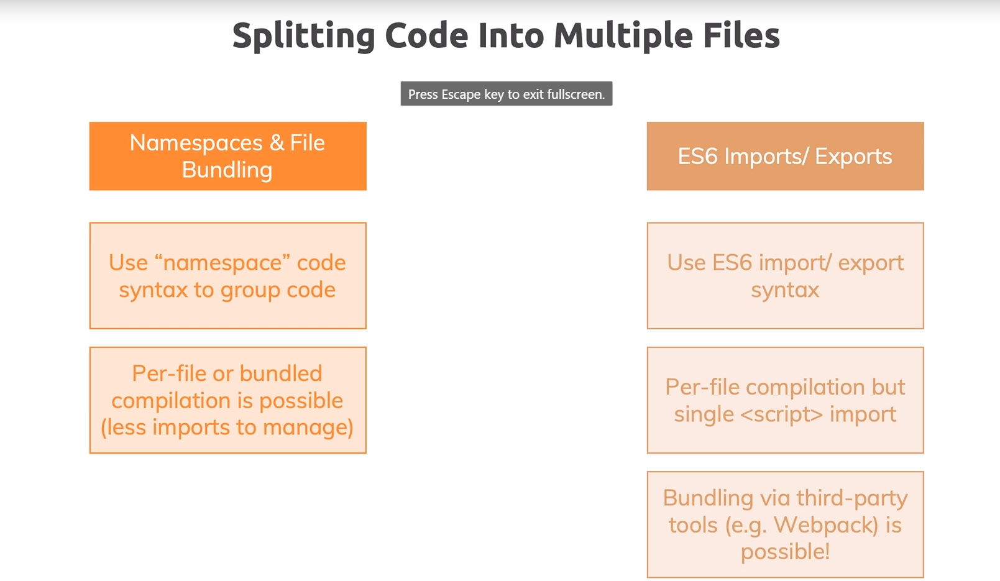
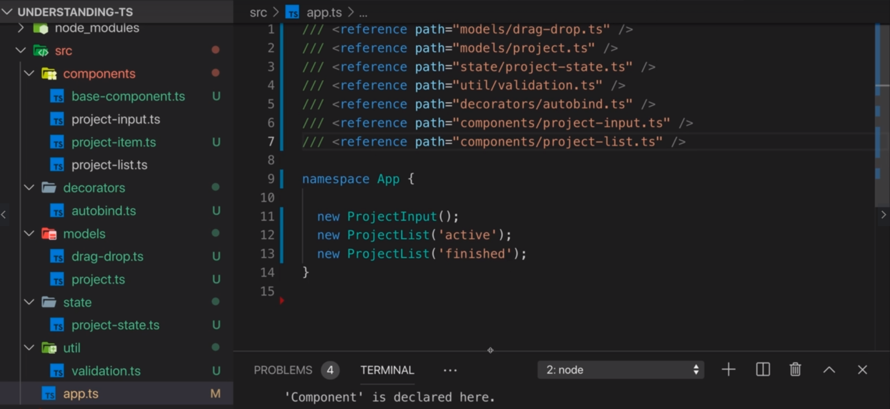

Modules & Namespaces
========================================================

Index
----------------------------------------

1. Module introduction 
2. Writing module code
3. Working wiht namespaces
4. Organizing files and folders
5. A problem with namespace imports
6. Browsers note 
7. Using ES modules
8. Understanding various import and export syntax
9. How does code in module execute
10. Wrap up

Module introduction
----------------------------------------
Our practice project has a lot of code all in one file and this is arguably not a super complex project. You can definitely ride way more elaborate projects and applications and you would end up with way more code so putting it all into one file is probably not what you want to do.

So what you want to do instead is you want to write modular code which simply means you want to split your code across multiple files so that each file on its own stays manageable and maintainable and you then simply import and export from into these files and make sure that data for all these files are connected but they're connected by typescript or by the browser or by some third party build tool and not by you.

Now in this module we'll have a look at two main options that help us with organizing our code in multiple files and we'll not just learn about them in theory but also in practice will of course apply these different approaches and see how we can split our code.

Writing module code - Your Options
----------------------------------------

The next image show us the options with their respective features that we have to write module code in big projects: Namespaces & File Bundling and ES6 Imports/Exports.



One option would be to simply write multiple code files then automatically compile all code files in the source directory and manually import to compiled JavaScript files into HTML.

That is an option and for some projects this might be just right. But you would have to manage all these imports manually which can be cumbersome and error prone and when using certain types of features you also give up type support.

Now let's review the namespace and file bundling option. A namespace is a container for set of identifiers, functions, methods and all that. It gives a level of direction to its contents so that it will be well distinguished and organized. So, you can have a namespace for a file.

Moreover, it also bundles the files together into one file. So that you have less imports to manage and you don't need to manually manage different imports and then html file.

For other side, we have the ES6 import/export feature, also now as ES6 modules as a solution for modern JavaScript.

Modern Java stripped out of the box supports import and export statements which allows to stay to which file depends on which other file and then you have all these individual files but you don't need to manage imports manually instead browsers.

Modern browsers do that they understand it and automatically download and run files or a number of files. depends on how you use the import export syntax for that, and typescript all the supports this so therefore you can use different types good without any issues you will compile per file but you only need one script import because as I just mentioned modern browsers know how to then fetch all our dependencies and you'll also see dad in action in this core section here.

Now one important note here is that we technically will end up with multiple files still and whilst we won't have to manage the imports manually the script imports we still have some disadvantages because of that because every failure depending on needs to be downloaded separately which means more HTTP requests hands on and therefore you can bundle files together to work on multiple files during development but ship a single file for production but you need third party tools for that. For example Webpack.

Working with namespaces
----------------------------------------
Let's start with the namespace approach. First of all lets create a `drag-drop-interfaces.ts` file and we will put the next body on there:

```typescript
// drag-drop-interfaces.ts
namespace App {
  export interface Draggable {
      dragStartHandler(event: DragEvent): void;
      dragEndHandler(event: DragEvent): void;
  }

  export interface DragTarget {
      dragOverHandler(event: DragEvent): void;
      dropHandler(event: DragEvent): void;
      dragLeaveHandler(event: DragEvent): void;
  }
}
```

Notice the use of the keyword `namespace` with the `App` id. Inside the namespace we have the `export` keyword before the interfaces to indicate that we will expose the interfaces. No, lets consume the namespace, as shown below:

```typescript
// app.ts
/// <reference path="drag-drop-interfaces.ts">
namespace App {
  
  // All the application
  // Project Type
  // Project State Management
  // Validation Interface
  // Decorators
  // Abstract Classes
  // Classes
}
```

The `///` is an special comment in typescript. In this case,the compiler understands it as a reference to some path, the file with the drag and drop interfaces. To use these interface, we have to create a namespace with the same `App` identifier. Without this detail, we can't consume the interfaces. Then we have to put all the code inside the namespace. If you have you watcher running, you'll see that in the `dist` folder we get to compiled files: `app.js` and `drag-drop-interface.js`. Keep this in mind, and now we will add a new file `project-model.ts` with the next content:

```typescript
// project-model.ts
namespace App {
  export enum ProjectStatus {
      Active,
      Finished,
  }

  export class Project {
      constructor(
          public id: string,
          public title: string,
          public description: string,
          public people: number,
          public status: ProjectStatus,
      ) {}
  }
}
```
Again, we create a namespace with the `App` identifier and we export the enum and the class inside the project model. We have to add the `/// <reference path="project-model.ts">` in the `app.ts` file, but, this time if you test the application we got an error add the moment of drag and drop a project because the `Active` type is undefined. If you check again the `dist` folder, you will see three compiled files: `app.js` `drag-drop-interfaces.js` and `project-model.js`. Then the problem is that the `Active` project status is out of the scope of the `app.js` file, that is the current file that we are importing from the `index.html`.

To fix this issue, we have to update the `tsconfig` file with the next values:

```javascript
{
  "compilerOptions": {
    /* Visit https://aka.ms/tsconfig.json to read more about this file */

    /* Basic Options */
    // "incremental": true,                   /* Enable incremental compilation */
    "target": "ES5",                          /* Specify ECMAScript target version: 'ES3' (default), 'ES5', 'ES2015', 'ES2016', 'ES2017', 'ES2018', 'ES2019', 'ES2020', or 'ESNEXT'. */
    "module": "amd",                     /* Specify module code generation: 'none', 'commonjs', 'amd', 'system', 'umd', 'es2015', 'es2020', or 'ESNext'. */
    "lib": [
      "dom",
      "es6",
      "dom.iterable",
      "scripthost"
    ],                             /* Specify library files to be included in the compilation. */
    // ...
    "outFile": "./dist/bundle.js",                   /* Concatenate and emit output to single file. */
```

It is important change the `"module"` property to `"amd"` value, that supports namespaces, and enable the `"outFile"` property with the path of a file that will concatenate all the sources files into just one file. In this case the `bundle.js` file. This means that we have to update the `<script>` tag value in out `index.html` file.

We have these namespace is here which is one step in the right direction because it is already is a bit more manageable. Now let's split this into even more files before we then have a look at the average splitting option.

Organizing files and folders
----------------------------------------

So, we can continue with this split strategy, so let's create a new file called named `validation.ts` with the next content:

```typescript
// validation.ts
namespace App {
  export interface Validatable {
      value: string | number;
      required?: boolean;
      minStringLength?: number;
      maxStringLength?: number;
      minNumberLength?: number;
      maxNumberLength?: number;
  }

  export function isValidInput(validatableInput: Validatable) {
      let isValid = true;

      if (validatableInput.required) {
          isValid = isValid && validatableInput.value.toString().trim().length !== 0;
      }
      if (validatableInput.minStringLength != null && typeof validatableInput.value === 'string') {
          isValid = isValid && validatableInput.value.length > validatableInput.minStringLength;
      }
      if (validatableInput.maxStringLength != null && typeof validatableInput.value === 'string') {
          isValid = isValid && validatableInput.value.length < validatableInput.maxStringLength;
      }
      if (validatableInput.minNumberLength != null && typeof validatableInput.value === 'number') {
          isValid = isValid && validatableInput.value > validatableInput.minNumberLength;
      }
      if (validatableInput.maxNumberLength != null && typeof validatableInput.value === 'number') {
          isValid = isValid && validatableInput.value < validatableInput.maxNumberLength;
      }

      return isValid;
  }
}
```

Similarly, we can split the code for `autobind.ts` related to the decorator:

```typescript
// autobind.ts
namespace App {
  export function autobind(
      target: any,
      methodName: string,
      descriptor: PropertyDescriptor
  ) {
      const originalMethod = descriptor.value;
      const adjustedDescriptor: PropertyDescriptor = {
          configurable: true,
          enumerable: false,
          get() {
              const boundFunction = originalMethod.bind(this);

              return boundFunction;
          }
      };

      return adjustedDescriptor;
  }
}
```

At this point we notice that we have several files at root level. So it is a good idea start to create folders to organize better the code. for example, we can create a `models` folder and put there `project-state.ts` and `drag-drop-interface.ts`. A `decorators` folder can store the `autobind.ts`, a `util` folder holds the `validation.ts` file, as so forth so on. In the end we got a folder structure as show the next image:



Keep in mind that we have to update the path references to guarantee the project functionality.

A problem with namespace imports
----------------------------------------
Now one important note by the way you might be wondering why `@autobind` works in `project-item.ts` and `project-list.ts` even though I didn't add import to the autobind decorator.

Well because in `app.ts` we have all the imports. Now, actually if we removed all the imports that are not in the component folder, which would be correct because in `app.ts` we technically only use to project input and the project lists on, we'll have a problem that you can see if does reloads. We have an error here even though we get no compilation error unfortunately but we get a runtime error so we need to make sure we import everything we use in a file into that file to be safe.

Technically we can import everything an `app.ts` and since `project-input.ts` and `project-list.ts` which for example used the `autobind.ts` decorator come later the order by decorator will be available when they need it.

But this is not the cleanest possible way. So what's the solution here. Well let's go back to the files and import what they need.

So it is the proper way of doing it every file specifies what it needs and we can split our code and still end up with one file so we get the best of both worlds. We could say yes, this is not necessarily the best possible way of doing it.

Browsers note 
----------------------------------------

> Important: In the next lecture, we'll use a feature which only works in modern browsers. 
> Later in the course, we'll find a way to make it work in older browsers as well, but for now make sure you are following along in Chrome or Firefox!

Using ES modules
----------------------------------------
Namespaces is a good solution but is not perfect. As you see in the last section we have to add each dependency manually. Additionally we are expose to a risk with namespaces. If someone change one file we get high probability to broke the program, because we are depending of the contents inside all the file. Should be great just consume the classes that we really need instead of the entire file. We get this behavior with ES6 modules.

So how works ES6 modules? Let's modify the `drag-drop.ts` file:

```typescript
/* Drag and Drop Interface
   -----------------------------------*/
export interface Draggable {
    dragStartHandler(event: DragEvent): void;
    dragEndHandler(event: DragEvent): void;
}

export interface DragTarget {
    dragOverHandler(event: DragEvent): void;
    dropHandler(event: DragEvent): void;
    dragLeaveHandler(event: DragEvent): void;
}
```

Here we remove the `namespaces App` and we keep the `export` keyword. With this declaration, we are saying that we can import these interfaces in other files. For this case we are using the inside the `project-item.ts` and `project-list.ts` files.

```typescript
import { Project } from '../models/project.js';
import { Draggable } from '../models/drag-drop.js';
import { ProjectComponent } from './base-component.js';
import { autobind } from  '../decorators/autobind.js';

export class ProjectItem extends ProjectComponent<HTMLUListElement, HTMLLIElement> implements Draggable { ... }
```

and for `project-list.ts` :

```typescript
import { Project, ProjectStatus } from '../models/project.js';
import { DragTarget } from '../models/drag-drop.js';
import { ProjectComponent } from './base-component.js';
import { ProjectItem } from './project-item.js';
import { autobind } from  '../decorators/autobind.js';
import { projectState } from  '../state/project-state.js';

export class ProjectList extends ProjectComponent<HTMLDivElement, HTMLElement> implements DragTarget { ... }
```

So we should update all the dependencies in the project to keep the application working. The trade off is that now, our code is modular and we are just exporting and importing specific parts of the files, making the code easier to maintain.

However the ES6 modules feature just works on modern browsers and this is something we have to reflect in the `tsconfig.json` file. To keep compatibility with old browsers we should use tools like webpack.

Understanding various import and export syntax
----------------------------------------
So using ES6 modules turns out there are some variations of that export import syntax which you should be aware of. For example,, you can bundle imports. Let's say that inside the `project_input.ts` file we want to group the export from the `validtaion.ts` file. To achieve that, we should use aliases as shown next: 

```typescript
...
import * as Validation from  '../util/validation.js';

export class ProjectInput extends ProjectComponent<HTMLDivElement, HTMLFormElement> {
    titleInputElement: HTMLInputElement;
    descriptionInputElement: HTMLInputElement;
    peopleInputElement: HTMLInputElement;

    constructor() { ... }

    configure() {
        this.element.addEventListener('submit', this.submitHandler);
    }

    renderContent() {}

    private gatherUserInput(): [string, string, number] | void {
        const enteredTitle = this.titleInputElement.value;
        const enteredDescription = this.descriptionInputElement.value;
        const enteredPeople = this.peopleInputElement.value;
        const titleValidatable: Validatable = {
            value: enteredTitle,
            required: true
        };
        const descriptionValidatable: Validation.Validatable = {
            value: enteredDescription,
            required: true,
            minStringLength: 5,
        };
        const peopleValidatable: Validation.Validatable = {
            value: +enteredPeople,
            required: true,
            minNumberLength: 0,
            maxNumberLength: 8,
        };

        if (
            !Validation.isValidInput(titleValidatable) ||
            !Validation.isValidInput(descriptionValidatable) ||
            !Validation.isValidInput(peopleValidatable)
        ) {
            alert('Invalid input, please try again');
            return;
        } else {
            return [enteredTitle, enteredDescription, +enteredPeople];
        }
    }

    private clearInputs() { ... }

    @autobind
    private submitHandler(event: Event) { ... }
}
```

With the `*` we are saying that we are importing all from `/util/validation.js`, and, with the `as` keyword we set the alias. So, now to use the class `Validatable` and the method `isValidInput` we should set the `Validation` as prefix. *Aliases* are a good feature for ES6 module as it makes easy read the code.

The other key feature are the *default exports*. The default export tells to JavaScript that the module with the `default` keyword is the main export. Check an example with the `base-component.ts` file:

```typescript
/* Abstract classes
   -----------------------------------*/
export default abstract class ProjectComponent<T extends HTMLElement, U extends HTMLElement> {
   ...
}
```

Keep in mind that you can just have one `default` export by file. At the moment to import a default module you can avoid the brackets and use whatever name you want to get the reference of the default export.

Default exports can be nice if you only have one thing per file. I personally prefer named exports though because you get auto completion you enforce a clear naming pattern.

If another developer imports your class or your export that thing he has to use your name which typically is good because it allows you to enforce certain naming conventions across a team or organization.

How does code in module execute
----------------------------------------
A valid question is what happens when you export one variable, and this variable is imported in two different files? The variable is declared twice? one per statement?

This is the case for the `projectState` variable that we export from the `project-state.ts` file and we use it in the `project-item.ts` and the `project-list.ts` file.

The answer is no, it runs once when the file is imported for the first time by any other file. If a number of file then imports that same file again it does not run again. You can validate this behavior adding a log in the `project-state.ts` file and checking that the log just run once.

Wrap up
----------------------------------------
And that's it for modules. Now, using modules is a super useful and important feature because it allows you to write more maintainable and manageable code.

Having it all in one file is a mess and really not an option for anything but very tiny projects using either namespace or ES6 modules is stale for a way better alternative since it makes sure that every file on its own is relatively small and therefore stays manageable.

Now when it comes to these two approaches name spaces and is modules the clear recommendation is ES6 modules because you get that extra type safety and you ensure that every file has to clearly specify what it wants with namespaces.

It was enough if one file import that's something that a number of file also needs. The downside is if that one file which imported the thing is removed that other file all the breaks 0without you noticing at least without you noticing before you run the code.

An important thing to be aware is that ES6 modules only work in modern browsers because we rely on the browser to basically import all these files.

So to make that work in all browsers we can use a bundling tool we can use Webpack for example to bundle that together into one JavaScript file so that during development we have this multi file strong typing experience, but, when we ship our code we actually have one file only and no advantage of shipping one file instead of all these files we have here is that we also ensure that the browser doesn't have to download that many files because every file that has to be downloaded is an extra hour round trip in the Network tab of the daft words you can actually see that there you see this waterfall chart and you see this little white box at the beginning of every block.

Useful resources and links
----------------------------------------
Attached you find all the code snapshots for this module - you also find them attached to individual lectures throughout this module.

These links might also be interesting:

- [JavaScript Modules (Overview)](https://medium.com/computed-comparisons/commonjs-vs-amd-vs-requirejs-vs-es6-modules-2e814b114a0b)
- [More on ES Modules](https://developer.mozilla.org/en-US/docs/Web/JavaScript/Guide/Modules)
