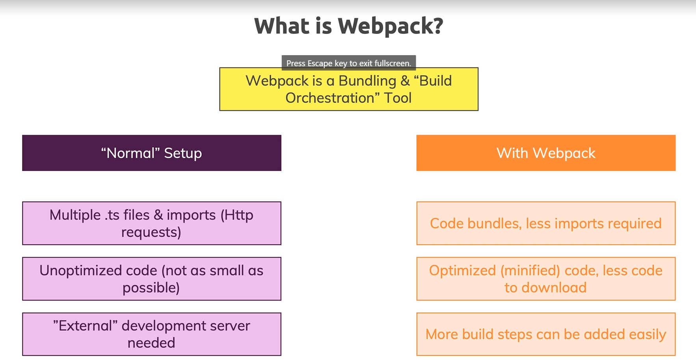

Using Webpack with TypeScript
====================
In the previous modules we worked on a project and dear we ever had all our code in one file which made it hard to manage or we actually split it into multiple files either by using namespaces or ES6 modules.

But, when using ES6 modules whilst our code was more manageable we actually had another disadvantage, the browser makes multiple requests to the files where we split the code.

We'll have a look at a solution Webpack. So in this section you will learn what exactly webpack is and of course stand we'll also use it to get a set up a project setup which gives us the best of all worlds actually where we can write code split up into multiple files without that disadvantage.

Index
-----
1. What is webpack and why do we need it?
2. Installing webpack and important dependencies
3. Adding entry and output configuration
4. Adding typescript support with ts-loader
5. Finishing the setup and adding webpack-deb-server
6. Adding production workflow
7. Wrap up

What is webpack and why do we need it?
-----------------------------------
So, as we mentioned before, the big issue that we have with normal setup is that currently our browser is making several HTTP requests to get the ES6 Module. We have some additional issues that are listed in the next image: 



So, Webpack is a building and build orchestration tool that allow us to attack the pain points that we got with a normal setup. This tool enter into the frontend devops field, and is a great mechanism to improve our application life cycle.

Installing webpack and important dependencies
-----------------------------------
To install webpack, let's run the next command at project level

```
$ npm install --save-dev webpack webpack-cli webpack-dev-server typescript ts-loader
```

After run this command, check the contents of the `package.json` file. It should be looks like:

```json
{ ...
  "devDependencies": {
    "lite-server": "^2.5.4",
    "ts-loader": "^8.0.4",
    "typescript": "^4.0.3",
    "webpack": "^4.44.2",
    "webpack-cli": "^3.3.12",
    "webpack-dev-server": "^3.11.0"
  }
}
```

All these dependencies were installed, so let´s review one by one: `webpack`  is the tool I just talked about. It's the heart of this entire setup we're now going to create, and, its allows us to plug in certain functionalities to bundle our code and also to transform our code. Fortunately, webpack is capable to bundle our `.ts` files into `.js`.

To run the tasks to bundle, we have the `webpack-cli`. This package basically offer us several commands to build our web page. The `webpack-dev-server` is a built in development server which starts webpack under the hood which watches our files for changes automatically triggers web page to recompile when something changes and which then also serves our page. 

The `ts-loader` and `typescript` packages handle all the stuff related to the TypeScript project. It is a good practice install a copy of TypeScript per project so that for this project you get a specific TypeScript where's the advantages that if you ever change your global ties with working you don't break your project whereas in your project setup if there were breaking changes in typescript itself.

That's why we install it separately here and the `ts-loader`, that is a package which will work together with webpack.

The `ts-loader` is a package that tells webpack how to convert type code to JavaScript so did web page is able to do both compile our code with the help of types of loader which in turn of course uses the types of compiler under the hood and then we pick all those able to bundle our emitted JavaScript files into a `bundle.js` file into **one** bundled code file

Adding entry and output configuration
-----------------------------------

Before to start, let's double check that our `tsconfig.json` file has the next setup:

```javascript
{
  "compilerOptions": {
    "target": "ES6",
    "module": "ES2015",
    ...
    "outDir": "./dist",
}
```
Now we have guarantees over the target, the module mechanism and the output directory of the project. Then we will create a `webpack.config.js` file with the next content:

```javascript
const path = require('path');

module.exports = {
    entry: './src/app.ts',
    output: {
        filename: 'bundle.js',
        path: path.resolve(__dirname, 'dist'),
    }
}
```

It is important keep the name of the file, because the webpack package will run the contents of the file, just if the name match. For other side, we have to remove all the `.js` extension from the imports that we got in our project, because, webpack by default will look for the `.js` files.

Returning to the content of the `webpack.config.js` file, we export a module with an `entry` field, to indicate where our project start (i.e `app.ts`), and an output field to indicate where we will put the bundle files that generate webpack. Here we use the `path` module of NodeJS, to set the path that with hold the created files.

Adding typescript support with ts-loader
-----------------------------------

Good, now let's add new properties in the `webpack.config.js` file, and we will explain one by one. Check the next snippet:

```javascript
const path = require('path');

module.exports = {
    entry: './src/app.ts',
    output: {
        filename: 'bundle.js',
        path: path.resolve(__dirname, 'dist'),
    },
    devtool: 'inline-source-map',
    module: {
        rules: [
            {
                test: /\.ts$/,
                use: 'ts-loader',
                exclude: /node_modules/
            }
        ]
    },
    resolve: {
        extensions: ['.ts', '.js']
    }
};
```

The `devtool` is a property that in this case is used in combination with the `sourceMap` field of the `tsconfig.json` file. Remember that sourceMap is a tool that facilities us the debugging of code. With the value of `inline-source-map` we are saying to webpack that use the sourceMap feature of TypeScript to handle the source mapping of the project.

the `module` property is a complex one because it offer the flexibility of webpack to set different rules over the tech stack that we are using in the application. The `rules` field is an array of objects that hold the association between the tech and the webpack loader. For this case we are indicating that the `.ts` files will use the `ts-loader` and we will exclude the contents of the `node_modules` directory. For these definitions, webpack use regular expressions in the values of the properties of the object.

The last property is `resolve`, used to set the input output relationship of the `.ts` files to the `.js` files.

Now, let's add a script in our `package.json` file to run the webpack command as show below:

```json
...
  "scripts": {
    "test": "echo \"Error: no test specified\" && exit 1",
      "start": "lite-server",
      "build": "webpack"
  },
```

For now, we will run the `npm run build` file and we can see that in the `/dist` folder we get the same folder structure of the `src`. We will use the lite server and if you check the project in the `localhost`, you see that in the network tab of the browser the quantity of the requests was reduced to the call of the `bundle.js` file. This is an important improvement.

Finishing the setup and adding webpack-dev-server
-----------------------------------
Let's start to use the `webpack-dev-server`. First, let's replace the start script in the `package.json` file, as shown below:
```json
...
  "scripts": {
    "test": "echo \"Error: no test specified\" && exit 1",
      "start": "webpack-dev-server",
      "build": "webpack"
  },
```

Cool, now if you test the `npm run start` command, we will have some differences, however, this set up is incomplete yet. We have to add some properties inside the `webpack.config.js` file. Check the next snippet:

```javascript
const path = require('path');

module.exports = {
    mode: 'development',
    entry: './src/app.ts',
    output: {
        filename: 'bundle.js',
        path: path.resolve(__dirname, 'dist'),
        publicPath: 'dist'
    },
    devtool: 'inline-source-map',
    ...
};
```

We add two new properties, `mode` and `publicPath`. The first one is to specify to webpack that the current configuration is for development environment, and the second one, is a complement for the `webpack-dev-server` to indicate were generate the compiled files.

Now, let's start with the setup for the production environment.

Adding production workflow
-----------------------------------

Before to start with the set up of the production environment lets install a webpack plugin called `clean-webpack-plugin` running the next command:

```
$ npm install --save-dev clean-webpack-plugin
```

Plug ins are extra for webpack. You can add to your webpack workflow which will basically be applied to the entire output to the entire project.

Rules and modules specifically are applied on a per file level. Plugins are applied to the general workflow.

Here we want to add a plug in which automatically deletes everything in the `dist` folder before a new output is written there.

Now, let's create a new file called `webpack.config.production.js` with the next content:

```javascript
const path = require('path');
const CleanPlugin = require('clean-webpack-plugin');

module.exports = {
    mode: 'production',
    entry: './src/app.ts',
    output: {
        filename: 'bundle.js',
        path: path.resolve(__dirname, 'dist'),
    },
    devtool: 'none',
    module: {
        rules: [
            {
                test: /\.ts$/,
                use: 'ts-loader',
                exclude: /node_modules/
            }
        ]
    },
    resolve: {
        extensions: ['.ts', '.js']
    },
    plugins: [
        new CleanPlugin.CleanWebpackPlugin(),
    ]
};
```

Notice that we have similarities with the `webpack.config.js` file. The differences are in the 'mode' field, we remove the `publicPath` key, and set the `devtool` to 'none'. Additionally, we set a new field `plugin'` to consume the `clean-webpack-plugin` that we installed before.

Now, just one step is remaining, an is updating the `build` script in our `package.json file`.

```json
...
  "scripts": {
    "test": "echo \"Error: no test specified\" && exit 1",
      "start": "webpack-dev-server",
      "build": "webpack --config webpack.config.prod.js"
  },
```

That's it, now we have a set up for a production environment.

Wrap up
-----------------------------------

So we added webpack a very important tool that allows us to bundle together our different files into one bundle.

This really helps us decrease the amount of HTTP requests made and therefore can speed up our application. If you find yourself working with a lot of individual files what you typically do in bigger projects tools, webpack is the most important and prominent tool that helps you with that.

You see that webpack is highly configurable and as we mentioned multiple times the official docs of webpack are the place to go to learn all about it about different loaders different other settings you can set up and how it works in general. So definitely dive into this documentation if you want to become a webpage monster and you want to have a more elaborate setup.

Our basic set up here however already allows us to compile type files with the webpack and then bundle to gather all the output into one single bundle JavaScript file and we also set up a configuration for development which makes debugging easier and gives us more helpful error messages and we get a production setup which gives us a highly optimized code which we then could deploy to a server to ship as little code as possible to it and that's it.

Webpack really is a core tool and being able to use it and having a configuration that really just works is super important. So it is a must use in any modern project. In this module you learned how you can get started with it in your types good projects.

Old notes
------------
- TypeScript inside project workflows with bundler, gulp and webpack.
- The watch command to left the TypeScript compiler open: `tsc -w`
- Use the `tsconfig.json` to control which files will be compiled with the `exclude` property

- How to TypeScript resolves Files using the `tsconfig.json` File
  - Run the `tsc` command
  - This command will check the configuration inside `tsconfig.json`
  - The `exclude` property tells to the compiler not check inside this files/folders
  - The opposite of exclude is the `files` property to be more explicit

- More on `tsc` and the `tsconfig` File
  - You can use the tsc command on specific file: `tsc app.ts`
  - Also is important the location of the `tsconfig.json` file
  - For more information check the official documentation of TypeScript in the section [Project Configuration](https://www.typescriptlang.org/docs/handbook/tsconfig-json.html)

- Adding TypeScript into a Gulp Workflow
  - Install gulp and gulp-typescript plugin: `npm install --save-dev gulp gulp-typescript`
  - Add a `gulpfile.js`
  - import `gulp` and `gulp-typescript`
  - `gulp-typescript` is a typescript wrapper
  - create the `typescript` task and associate it to the `tsconfig.json`
  - You can check the [gupl-typescript documentation](https://www.npmjs.com/package/gulp-typescript)

- Adding TypeScript into a Webpack Workflow
  - Install webpack and the gulp loader: `npm install --save-dev webpack ts-loader`
  - Remove the SystemJS code for loads files.
  - Now you are using webpack. Then use bundle.js to load your files
  - Remove the `exclude` property from `tsconfig.json`. Now it is responsibility of webpack
  - Also remove the `module` and `sourceMap` properties. Now it is responsibility of webpack
  - Add the file `webpack.config.js`
  - Remember that webpack always use the local package installed in the project. No matters if the package ins installed globally
  - Finally change the syntax to import jQuery `imsport $ = require(jquery)`

Resources
----------------------------------------
- [Official Webpack Docs](https://webpack.js.org/)
