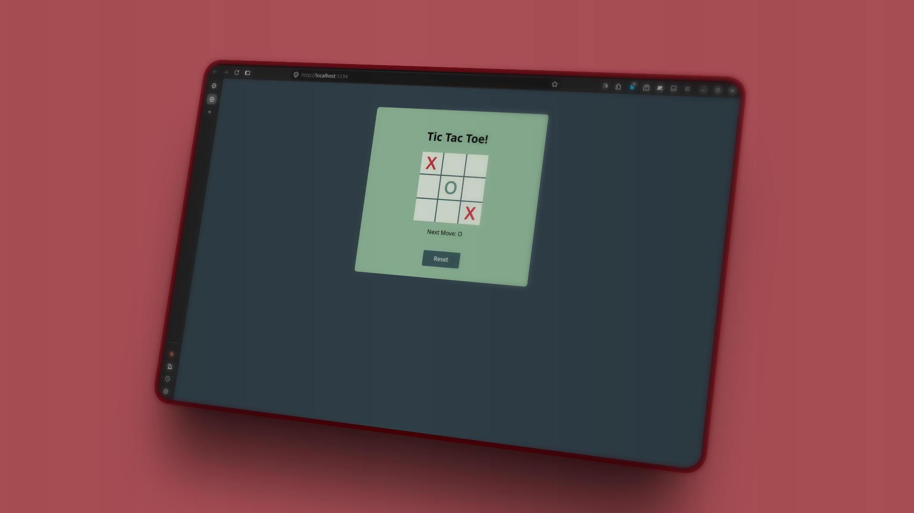

<h1 align="center">
  <a href="https://ui.dev">
    
  </a>
  <br />
</h1>

<h3 align="center">TypeScript Course Project - Tic Tac Toe</h3>

## ℹ️ Info

This is the repository for UI.dev's "TypeScript" course project.

For more information on the course, visit **[ui.dev/typescript](https://ui.dev/typescript/)**.

## 🗼 Project

This project is a "Tic Tac Toe" app. You'll be able to play tic tac toe against yourself and have all of your code type checked by the TypeScript compiler.



## 👣 Steps

1. Define the base types `Cell`, `TicTacToeBoard` and numbers.
2. Add the `addEventListener` to record the click event a mark the `X` or `O`.
3. Set the state management to define the winner via an array with the win cases.

## 🧰 Tech Stack

- **TypeScript** - Type-safe JavaScript
- **Parcel** - Zero-configuration bundler with hot reload
- **HTML/CSS** - Vanilla DOM manipulation

## 🧞 Commands

```bash
# Install dependencies
pnpm install

# Start development server with hot reload
pnpm start

# Build for production
pnpm build
```