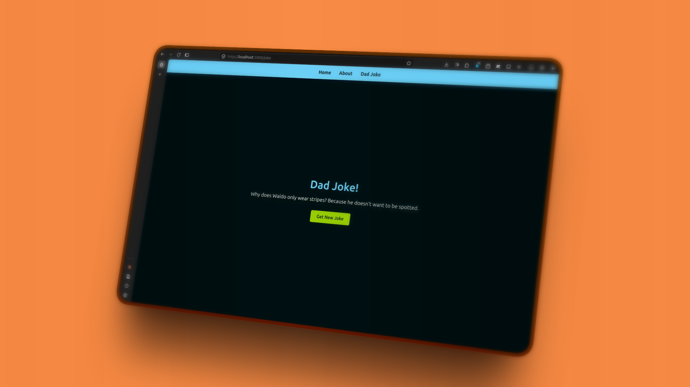

# 🗼 Project Overview

A node server that consume the https://icanhazdadjoke.com API to get a dad joke in one of their static pages.



## 🧰 Tech Stack

- **TypeScript** - Primary language
- **Node.js** - Runtime environment
- **Package Manager**: PNPM (monorepo workspace)

## 🧞 Commands

```bash
# Install dependencies
pnpm install

# Start development server with hot reload
pnpm start

# Build for production
pnpm build
```