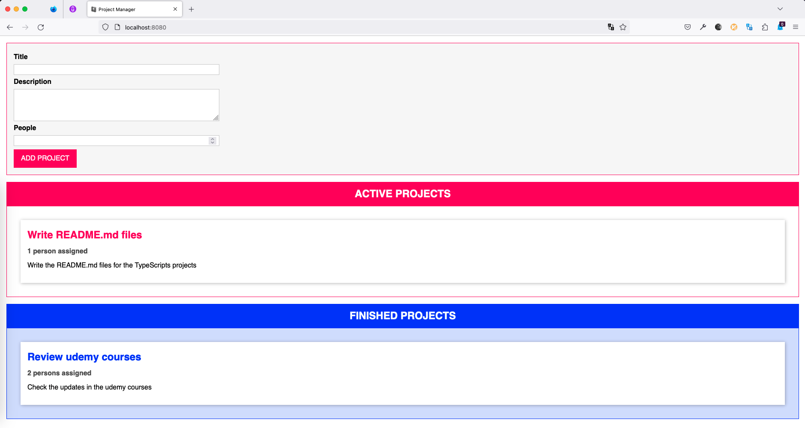

Planner
=======

This is project to practice TypeScript. In short is a task manager via drag and drop. Below is the UI of the app.



🥅 Goal
----

Let's build a web application where we can enter an a form with the title/description/people structure to create task and update the state of each task with a drag and drop interaction the UI of the project looks like:


🚀 Launch
---------

To run the web app execute the next command:

```bash
npm run start
```

This loads the server in the next router:

- http://localhost:8080

🧰 Tech Stack
-------------

- typescript
- webpack