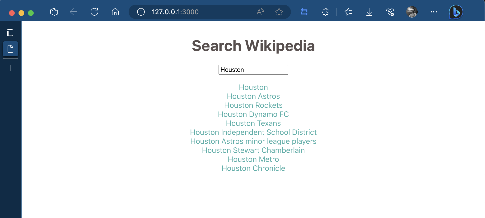

Wiki Search
==========

App to explore the combination of functional reactive programming with solid.js and fp-ts.

🥅 Goal
-------

How the functional programming and the reactive programming can works together. Those worlds can be combined at some point. Functional Reactive Programming is a paradigm that exists for decades and can be more valuable now then ever, especially for front-end development purposes.

📱 The app
----------

Let's display search results for Wikipedia. To achieve that, below are the requirements of this project:

- Add an input for our search query.
- After user provides the query, display data from API as a list matching the query.
- Do not trigger the API request until the user is done with the writing the query. (i.e. do not query the API with every provided character)
- If the API call fails, provide use with a meaningful message of what went wrong.

Below the UI of the app:

🧰 Tech Stack
-------------

- typescript
- fp-ts
- solid.js
- zod
- ts-pattern