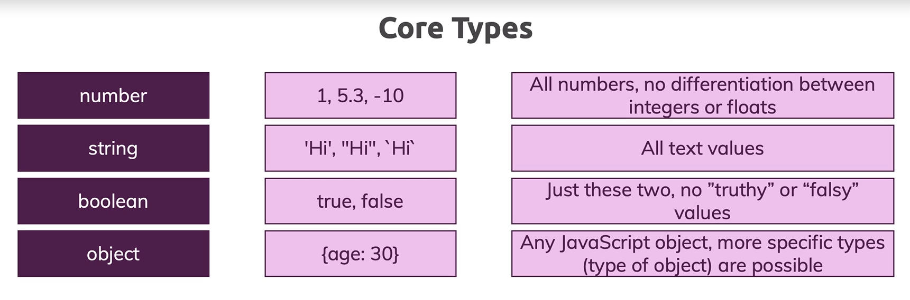

Section 2: TypeScript Basics & Basic Types
======================================

Index
------------
1. Using Types
2. TypeScript Types vs JavaScript Types
3. Working with Numbers, String & Booleans
4. Type Assignment & Type Inference
5. Object Types
6. Nested Object & Types
7. Arrays Types
8. Working with Tuples
9. Working with Enums
10. The Any Types
11. Union Types
12. Literal Types
13. Type Aliases & Custom Types
14. Function Return Types & Void
15. Function as Types
16. The Unknown & the Never Types


Using Types
-----------
TypeScript provides many types to JavaScript, but JavaScript itself also knows some data types. The following diagram summarize the core types of JavaScript.


Not much to add, just keep in mind that the `Truthy` and `Falsy` values are not boolean types.

Good, now let's go back to our `add` function example in his JavaScript version:

```javascript
function add(num1, num2) => num1 + num2;

const number1 = '5';
const number2 = 3;

const result = add(number1, number2);
console.log(result) // prints 53
```

Let's add types to this version;


```typescript
function add(num1: number, num2: number) => num1 + num2;

const number1 = '5';
const number2 = 3;

const result = add(number1, number2);
console.log(result); // prints 53
```

Notice that the `number1` data type is still a `string`. With this variant, TypeScript will warning us that the `add` function is expecting a `number` type and we are sending a `string` type. This warning is showed just during development. That means, *TypeScript's type system only help you before the code gets compiled*. We can go ahead and compile the code with this error, the TypeScript compiler will generate the respective `js` file anyway, but, you will get an error message form the compiler.

To fix the compiler error just follow the warning message, and pass a `number` type to the `add` function.

TypeScript Types vs JavaScript Types
-----------------------
We also know that there is a `number` type in JavaScript via the built in `typeof` operator. The `typeof` operator is not specified to TypeScript, is supported in a keyword by JavaScript and we can use it the get the type of certain values. We use this operator to create a pure JavaScript version of the `add` function:

```javascript
function add(num1, num2) {
    if (typeof num1 !== 'number' || typeof num2 !== 'number') {
        throw new Error ('Incorrect input!'); // Print the error
    }
    return num1 + num2;
} 
const number1 = '5';
const number2 = 3;

const result = add(number1, number2);
console.log(result);
```

If we run the last code we get the `Incorrect input!` message as expected. However this approach has downsides. Sometimes it is the right thing to do, sometimes you only can validate certain inputs in runtime. The main downside here is that we are checking something which we actually can avoid during development with TypeScript, and here we see the difference between JavaScript and TypeScript when it comes to types.

JavaScript is *dynamically typed*, which means it is perfectly fine that we have a variable which initially might hold a `number` where we later assign a `string` to it. That is why we have the `typeof` operator so that we can check the current type of something at runtime.

In the other hand, TypeScript is *statically typed*, which means we define the types of variables and parameters end on during development. They do not suddenly change during runtime. Of course, TypeScript is compiled to JavaScript, so theoretically it could change the types of a variable at runtime, but we will previously notified via the TypeScript compiler.

> Note: In TypeScript, you work with types like `string` or `number`. It is `string` and `number` (etc.), NOT `String`, `Number` (etc.), **the core primitive types in TypeScript are all lowercase!**


Working with Numbers, String & Booleans
----------------
In our JavaScript version of the `add` function we use String, Booleans and Number data types. Let's include some parameters to the `add` function to explicitly define the print of the addition result via a boolean.

```javascript
function add(num1: number, num2: number, canShowResult: boolean, phrase: string) {
    const result: number = num1 + num2;

    if (canShowResult) {
        console.log(phrase, result);
    } else {
        return result;
    }

} 

const number1 = 5;
const number2 = 3;
const canShowResult = true;
const resultPhrase = 'Result is: ';

add(number1, number2, canShowResult, resultPhrase);
```

This version receive as parameter a `boolean` to set a condition to print the result in the browser console, and a phrase `string` to add a message in the console log. Notice that the `num1` and `num2` are not passed directly in the console log, because for this case JavaScript will apply type coercion an instead of print the result as an addition it will be concatenate strings:

Type Assignment & Type Inference
--------------------------------
So we are using the core types and until here, in the list of parameters of the function we are always explicitly assigning to types with a colon (e.g `num1: number`). The types works as special keywords of a syntax which is added by TypeScript. It is not part of the compile JavaScript code.

The special keyword are interpreted by the TypeScript compiler, and there are called explicit type assignment. Let's check the next code: 

```typescript
let number1: number;
number1 = 5;
```

Here we define a variable but we are not initialize it with some value. I know that this case is redundant but, it works to explain the type assignment. After define the variable we give a value to the variable that is `5`. With this scenario TypeScript compiler won't throw warning messages because we are using a `number` as expected. If we change the value of 5 to `'Hello'` the TypeScript compiler will throw us an error, we are expecting a `number`, not a `string`;

Now, let's check the next line, to explain the type inference feature of the TypeScript compiler:

```typescript
const number1 = 5;
```

Here, we initialize `number1` with the `5` value. How the variable is initialize with a number, the TypeScript compiler will *infer* that the type of the variable `number1` will a `number`. For this case it is redundant use the type assignment an it is consider a bad practice.

In brief, if the variable is unassigned, consider use the type assignment, if not let that the TypeScript compiler use his type inference feature.


Object Types
--------------------------------
Following with the core types diagram, lets add the Object Type:



We know that objects in JavaScript are declared with curly braces that inside have key value pairs. These values would all be treated as object types in TypeScript. TypeScript offer us the possibility to define object with specific types.

Let's check the next code sample:


```typescript
const person: {
    name: string;
    age: number;
} = {
    name: 'Edward',
    age: 16,
}

console.log(person.name)
```

Here we declared a `person` object with two properties: `name` of type `string` and `age` of type `number`. If in the assignation of the values, if we change the value of the age from `16` to `true`, the compiler will throw an error saying that the expect type of the `age` key should be a `number`.

> **Note:** Could be confusing the syntax for the type assignment and the key value pairs of the object because both use the colon as separator of the elements. The key distinction is that when we use type assignment the line ends with a semicolon `;` and the key value pairs ends with a comma `,`.

For this case, we use the type assignment that offer TypeScript, but with this version we could be redundant. The next code is a clean version of our last snippet:


```typescript
const person {
    name: 'Edward',
    age: 16,
}

console.log(person.name)
```

We got the same results and take advantage of the type inference feature of the TypeScript compiler. Also, keep in mind that if we change the log line to `console.log(person.nickname)` the compiler will throw a message indicating that we are trying to access to a property of the object that not exist.

Nested Object & Types
--------------------------------
Of course object types can also be created for **nested objects**.

Let's say you have this JavaScript **object**:

```typescript
const product = {
  id: 'abc1',
  price: 12.99,
  tags: ['great-offer', 'hot-and-new'],
  details: {
    title: 'Red Carpet',
    description: 'A great carpet - almost brand-new!'
  }
}
```

This would be the **type** of such an object:

```typescript
{
  id: string;
  price: number;
  tags: string[];
  details: {
    title: string;
    description: string;
  }
}
```

So you have an object type in an object type so to say.


Arrays Types
--------------
Time to review the arrays types, we will continue with our core types diagram:


So with TypeScript we can use any JavaScript array an the types can be flexible or strict. Let's check an example of a strict array:

```typescript
let favoriteActivities: string[];

favoriteActivities = ['Alchemy'];
// favoriteActivities = ['Alchemy', 1]; Error!
```

Notice that for assign the type we use the `string[]` syntax. Now we are telling to the TypeScript compiler that all the values in the `favoriteActivities` should be an array string. If we uncomment the fourth line, we will get an error from the compiler saying that a number cannot be assignable to an array of strings. To attend this case we should change the type assignation for the `favoriteActivities` variable to `any[]`. With this syntax we got flexible types in our array.

Besides, if we define an array of strings we can use all the valid method of the strings values that are in the array, lets check then next snippet:

```typescript
const person = {
    name: 'Edward',
    age: 16,
    hobbies: ['Alchemy', 'Travel']
}

for (const hobby of person.hobbies) {
    console.log(hobby.toUpperCase());
}
```

As you can see, when we iterate the array we are able to use the `toUpperCase` method for the strings that are in the `hobbies` array.

Working with Tuples
-----------------------------------------
Until now we review the types that JavaScript offer and how TypeScript add restrictions over these types. However, TypeScript adds a couple of new concepts and new types which we do not know from JavaScript, like a **tuple**.

A type is a fixed-length array, that could be useful when you have a scenario where you need exactly x amount of values in an array and you know the type of each value in advance. With tuples, we can be more strictness and even clearer about the type of data your are working with the type of data you are expecting. Let's check the next snippet to get familiar with the tuple concept:

```typescript
const person: {
    name: string;
    age: number;
    hobbies: string[];
    role: [number, string];
} = {
    name: 'Edward',
    age: 16,
    hobbies: ['Alchemy', 'Travel'],
    role: [0, 'hero'],
}

person.role[0] = 1;
// person.role[0] = 'enemy'; ✘: expected an number value
person.role.push('enemy');
```

In the last code, we add a new `role` property with a tuple type whose inner types are `[number, string]`. If we assign a value for the first element of the array that not corresponds to a `number`, the TypeScript compiler will indicating an error that the current value is not assignable to a `number` type.

An important detail happens with the `push` array's method. As you can see in the last line we use it, and we not get errors, even when the pushed values not accomplish with the restriction of the tuple type. We're all the saying that `role` should have exactly two elements but why can we push `enemy` onto the `role` array?. `push` actually is an exception which is allowed and bowls so unfortunately types who can't catch this error.

Working with Enum
------------------------
Loosely related with the idea of a tuple is the idea of having a couple of specific identifiers in global constants you might be working within your app which you want to represent as number, but you want to assign a human readable label, and for that you have the `Enum` type, that is an addition of TypeScript.

Let's play with the `role` property of the `person` object to illustrate this type.

```typescript
const PRESIDENT = 0;
const ALCHEMIST = 1;
const STATAL_ALCHEMIST = 2;
const HOMUNCULUS =3;

const person = {
    name: 'Edward',
    age: 16,
    hobbies: ['Alchemy', 'Travel'],
    role: STATAL_ALCHEMIST,
}

if (person.role === STATAL_ALCHEMIST) {
    console.log('Hello full metal!');
}
```

Here, we define a series of global constants with the possible roles of the `person` object. When we create the `person` object, in the `role` property we use one of those constants. Finally, we set a condition to execute an specific code according to the `role` of the person. This code works, but with `enums` we can do it better, as shown next:

```typescript
enum Role {
    PRESIDENT,
    ALCHEMIST,
    STATAL_ALCHEMIST,
    HOMUNCULUS,
}

const person = {
    name: 'Edward',
    age: 16,
    hobbies: ['Alchemy', 'Travel'],
    role: Role.STATAL_ALCHEMIST,
}

if (person.role === Role.STATAL_ALCHEMIST) {
    console.log('Hello full metal!');
}
```

Several things to highlight in this snippet. First, `enum` is a custom type and by convention his values should be start with a capital letter. Often, you will see enums with all-uppercase values, but that is not a "must-do". Second, in the `enum` definition we do not use the equal sign `=` and the colon sing`:` neither, just the curly braces. Lastly, the internal values of the `enum` will be assigned by default to a number value from 0 to the number of elements in the enum. In this case `PRESIDENT` get `0`, `ALCHEMIST` get `1`, so forth and so on. You can customize this values as shows below:


```typescript
enum Role {
    PRESIDENT = 2,
    ALCHEMIST = 4,
    STATAL_ALCHEMIST = 8,
    HOMUNCULUS = 16,
}
```

So enum is great to construct whenever you need identifiers that are human readable and have some mapped value behind the scenes.

The "any" type
----------------
The `any` type is the most flexible type you can assign in TypeScript. This type does not tell anything to the TypeScript compiler, it basically means you can store any kind of value there. The next snippet shows the syntax to use the `any` type: 

```typescript
let favoriteActivities: any[];
favoriteActivities = [2, "Alchemy"]
```

We should use the `any` type with care, because his use go against the benefits that TypeScript offer us as Developers. This type give us the same experience you have with vanilla JavaScript.

In the next figure we resume the core types that we evaluate in the previous sections:


The Union Types
-----------------------------
To explain the *union type* (`|`) let's recall the `add` function, and we will introduce the next change: Now this function could receive two type of inputs, `number` and `string`. If the inputs are `number`, then the function execute the addition. If the inputs are `string`, then the function will concatenate both strings. The next snippet met this goal:

```typescript
function combine(input1: number | string, input2: number | string) {
    let result;

    if (typeof input1 === 'number' && typeof input2 === 'number') {
        result = input1 + input2;
    } else {
        result = input1.toString() + input2.toString();
    }

    return result;
}

const combinedAges = combine(30, 26);
console.log(combinedAges);

const combinedNames = combine('Edward', 'Elric');
console.log(combinedNames);
```

As you can see we use the union type in the signature of the `combine` function. There, we are saying that the parameters could be a `number` or a `string`. The union types could be useful to gain flexibility in our functions. You will certainly also encounter situations in types good programs where you can use a union type without a runtime type check.

It really depends on the logic your writing.


The Literal Types
-----------------------------
Literal types are types where you don't just say that a certain variable or parameters should hold let's say a `number` or a `string` but where you are very clear about the exact value it should hold (e.g `const number = 2.8`). To go deep with the concept let's add a third parameter to the `combine` function as a identifier to perform a conversion of the `result`. Next snippet illustrate this case.


```typescript
function combine(
    input1: number | string,
    input2: number | string,
    resultConversion: 'as-number' | 'as-text'
) {
    let result;

    if (typeof input1 === 'number' && typeof input2 === 'number' || resultConversion === 'as-number') {
        result = +input1 + +input2;
    } else {
        result = input1.toString() + input2.toString();
    }

    return result;
}

const combinedConversionAges = combine('30', '26'), 'as-number';
console.log(combinedAges);
```

First of all, we add the third parameter with a literal type `'as-number' | 'as-text'`. This literal type use the union type explained before. Literal types are the types which are based on your core types, `string`, `number` and so on, but you don't have a specific word in off that type. So here we allow us specifically these two strings not any string just these two strings. If we want a string for resolved conversion but it has to be one of these two values and any average string value will not be allowed.

That's the idea behind a literal type and often you will use this in the context of a union type because you don't just want to allow one exact value you could hardcoded into your code if that would be the case but you want to have two or more possible values.

Finally, in the `combinedConversionAges` we call the function with the `'as-number'` literal type, if we have a type the TypeScript's compiler will show us an warning saying that the expected literal type should be `as-number` or `as-string`.

So these are literal types especially useful when used in conjunction with union types.

Custom Types And Types Aliases
---------------------------------
When we are working with union types, can be cumbersome to always repeat the union type. You might to create a new type which he store this union type and the use it after. TypeScript offer us a cool feature called *type aliases* to define our custom types before use it. Next code is a improve version of the `combine` function and will help us to understand type alieases.

```typescript
type Combinable = number | string;
type CombinableDescriptor = 'as-number' | 'as-string';

function combine(
    input1: Combinable,
    input2: Combinable,
    resultConversion: CombinableDescriptor,
) {
    let result;

    if (typeof input1 === 'number' && typeof input2 === 'number' || resultConversion === 'as-number') {
        result = +input1 + +input2;
    } else {
        result = input1.toString() + input2.toString();
    }

    return result;
}

const combinedConversionAges = combine('30', '26', 'as-number');
console.log(combinedConversionAges);
```

The definition of a type alias require the `type` keyword that is part of TypeScript. Here you can set any name to your alias and assign to the respective core values. Then when we declare the parameters for the `combine` function we are using the type aliases created before.

The main advantage of use aliases to custom types is flexibility. So type aliases are really useful. You can encode more complex type definitions into your own types into your own type names. So to say and reuse that everywhere in your code where you need exactly this type setup. So did you have wide typos down there and you can simply save code write code quicker and also be clearer about your intentions for example by choosing descriptive type alias names up there.

### Type Aliases and objects
Type aliases can be used to "create" your own types. You're not limited to storing union types though - you can also provide an alias to a (possibly complex) object type.

For example:

```typescript
type User = name { name: string, age: number };
const userOne = User = { name: 'Edward', age: 16 }
```

This allows you to avoid unnecessary repetition and manage types centrally/

For example, you can simplify this code:

```typescript
function greet(user: { name: string, age: number }) {
    console.log('Hi, I am'+ user.name);
}

function isOlder(user: { name: string, age: number }, checkAge: number) {
    return checkAge > user.age;
}
```

To:

```typescript
type User = { name: string, age: number };

function greet(user: User) {
    console.log('Hi, I am'+ user.name);
}

function isOlder(user: User, checkAge: number) {
    return checkAge > user.age;
}
```

Function Return Types & Void
---------------------------------
With TypeScript we can explicitly assign a return type to the functions adding a colon (`:`) after the parameter list. The next code is an example of this syntax:

```typescript
function add(n1: number, n2: number): number {
    return n1 + n2;
}
```

Keep in mind that for functions, the type inference feature is active from the TypeScript compiler. For this case the TypeScript's compiler will infer that the return type of the function it is a `number` type due to the parameters. So, we are being redundant in this case. For demo purpose the next version could be give us an accurate idea of the function return types:

```typescript
function add(n1: number, n2: number): string {
    return n1.toString() + n2.toString();
}
```

In this case we expect a `string` as return type, but the parameters are still `number`. That is the reason why we have to use the `toString` method.

Now, we have cases where the function not return anything, like the next log function:

```typescript
function printResult(num: number): void {
    console.log('Result ' + num);
}

printResult(add(5, 12));
```

For this we can use the `void` type. Now let's a discuss an interesting relation between `void` and `undefined`. For that let's check the next line of code example:

```typescript
console.log(printResult(add(5, 12)));
```

In JavaScript of course if we would `console.log` the result of `printResult` here and we now compile it to see what gets output here on the page that is `undefined`. So technically and that's re interesting in JavaScript if we use the return value of a function that doesn't return anything we get `undefined` as a value.

You probably know `undefined` in JavaScript is actually a real value, a value you for example also get if you try to access a property on an object which doesn't exist.

Now to make it even more confusing `undefined` actually is a type in TypeScript. For example a brand new variable some value can receive `undefined` as a type and you will not get an error.

This variable will now just be forever `undefined` how useful that might be as a different question but `undefined` is a valid type and TypeScript nonetheless here you see we're getting an error and we are getting an error because a function is not allowed to return `undefined`.

Technically it of course does but TypeScript thinks about functions a bit differently. You should use why here if a function returns nothing and not `undefined` because with y you make clear that this function deliberately does not have a return statement.

If you would say `undefined` here then TypeScript would expect that you have a return statement where you just don't return a value, and that's the technical difference.

So, in functions we use the `void` type for functions that not return anything.

The `never` type
----------------
1. Type used when a function never returns a value

The `null` type
---------------
1. Is used with union types, and require add a `strictNullChecks` configuration in the `tsconfig.json`
