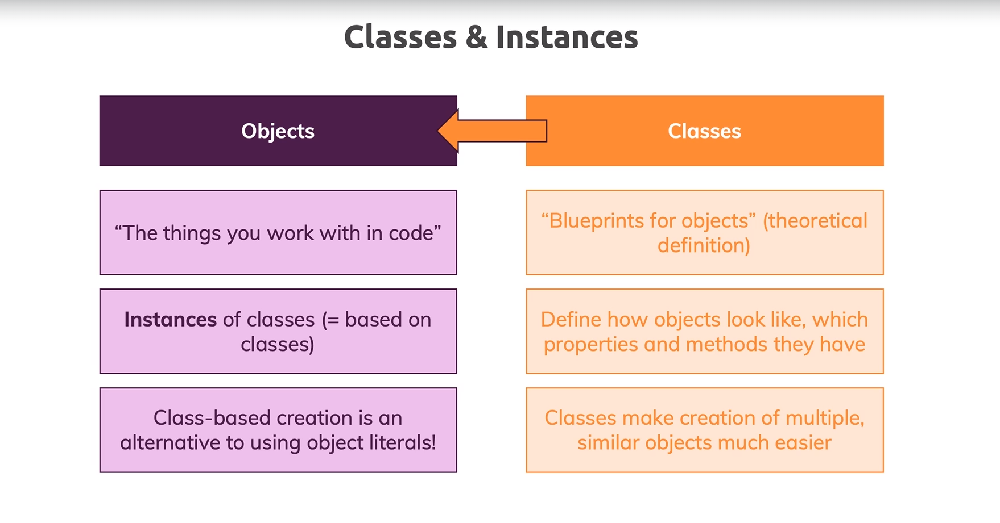

Section 5: Classes & Interfaces
==========================================

In this module we'll explore classes and interfaces. Where and why we use them. Then we'll have a detailed look at classes and they are all that our concept called inheritance and add interfaces what they bring to the table how they're compile to JavaScript and why we might use these features.

Index
--------------------------------
1. What are Classes?
2. Creating a First Classes
3. Compiling to JavaScript
4. Constructor Functions & The "this" Keyword
5. "private" and "public" Access Modifiers
6. Shorthand Initialization
7. "readonly" properties
8. Inheritance
9. Overriding Properties & The "protected" Modifiers
10. Getters & Setters
11. Static Methods & Properties
12. Abstract Classes
13. Singletons & Private Constructors
14. Classes Summary
15. A First Interface
16. Using Interfaces with Classes
17. Why Interfaces
18. Readonly Interface Properties
19. Extending Interfaces
20. Interfaces as Functions Types
21. Optional Parameters & Properties
22. Compiling Interfaces to JavaScript
23. Wrap Up
24. Resources

What are Classes?
--------------------------------
Before to explain classes, it is necessary expose the object-oriented programming (OOP) paradigm.

The idea behind object oriented programming and classes is that you work with real life entities in your code.

With this approach, you work with objects that resemble real life objects as far as possible, at least to make it easier for you as a developer to reason about your code. The next image is an example of the entities behind an e-commerce: product list, product and shopping cart.

Notice that each entities have his own responsibilities. Moreover, with an arrow we identify the relationships between this entities. This way, a developer build a schema, splitting logical pieces to resolve a specific problem. In this case, consolidate an e-commerce.

With the notion of entities, we can go ahead with objects and classes. The next image shows the difference between this two concepts and how they are related.

In brief, a object is an instance of a class and classes help us define how objects should look like, which properties and methods to have and so on.

Classes exist to speed up the creation of objects and it's simply an alternative to using the object. Also, they make it easier to create multiple objects, which generally have the same structure and the same efforts, which might only differ with the exact data details which are stored in there.

Creating a First Classes
--------------------------------
Compiling to JavaScript
--------------------------------
Constructor Functions & The "this" Keyword
--------------------------------
"private" and "public" Access Modifiers
--------------------------------
Shorthand Initialization
--------------------------------
"readonly" properties
--------------------------------
Inheritance
--------------------------------
Overriding Properties & The "protected" Modifiers
--------------------------------
Getters & Setters
--------------------------------
Static Methods & Properties
--------------------------------
Abstract Classes
--------------------------------
Singletons & Private Constructors
--------------------------------
Classes Summary
--------------------------------
A First Interface
--------------------------------
Using Interfaces with Classes
--------------------------------
Why Interfaces
--------------------------------
Readonly Interface Properties
--------------------------------
Extending Interfaces
--------------------------------
Interfaces as Functions Types
--------------------------------
Optional Parameters & Properties
--------------------------------
Compiling Interfaces to JavaScript
--------------------------------
Wrap Up
--------------------------------
Resources
--------------------------------

Creating classes and class properties
-------------------------------------
1. Classes allow you to prepare some type of blueprints for your objects
2. `private` makes accessible the variable for the class where is defined
3. `protected` is an extension of `private` and allows make accessible the variable for another classes
4. `public` keyword is a shortcut for create a property, getting the argument and assign it

Class methods and access modifiers
----------------------------------
1. Just use the dot notation and be aware of the properties's scope

Inheritance
-----------
1. Use the `extends` keyword when the class is defined

Inheritance and Constructors
----------------------------
1. The inherit class have to use the `super` keyword in his `constructor`

Inheritance Wrap Up
-------------------
1. All the exposed super class's properties and methods are accessible by the inherit class

Getters and Setter
------------------
1. Control the access to your properties.
2. Assign a value
3. Return a values

Static properties and methods
----------------------------
1. `static` keyword allow us to use the properties of a class without instantiate it.
2. Ideal for helpers classes

Abstract Classes
----------------
1. `abstract` keyword allow us to create classes that can't be instantiated. Works as a blueprint.
2. `abstract` keyword in methods doesn't have logic. Works as a guide to the class that use the abstract class to show that the logic of the abstract method is responsibility of that class.
3.  Abstract classes always have to be inherit

Private constructors & singletons
---------------------------------
1. Singleton: is a pattern where you have just one instance of a class in runtime

Read only properties
-------------------
1. Use a getter
2. Add the `readonly` keyword in the constructor parameter
