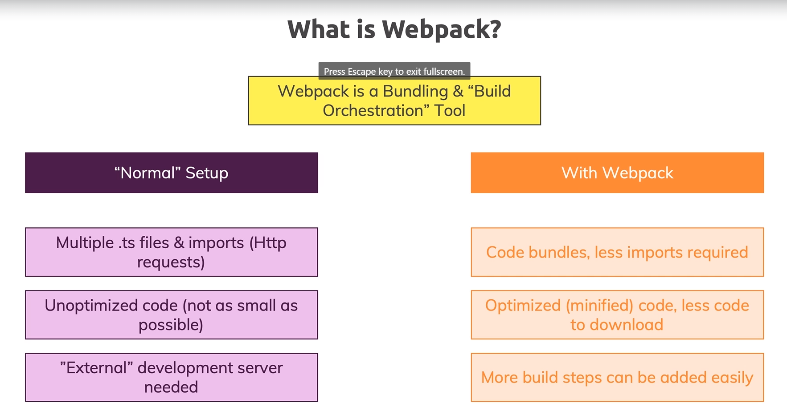

Using Webpack with TypeScript
====================
In the previous modules we worked on a project and dear we ever had all our code in one file which made it hard to manage or we actually split it into multiple files either by using namespaces or ES6 modules.

But, when using ES6 modules whilst our code was more manageable we actually had another disadvantage, the browser makes multiple requests to the files where we split the code.

We'll have a look at a solution Webpack. So in this section you will learn what exactly webpack is and of course stand we'll also use it to get a set up a project setup which gives us the best of all worlds actually where we can write code split up into multiple files without that disadvantage.

Index
-----
1. What is webpack and why do we need it?
2. Installing webpack and important dependencies
3. Adding entry and output configuration
4. Adding typescript support with ts-loader
5. Finishing the setup and adding webpack-deb-server
6. Adding production workflow
7. Wrap up

What is webpack and why do we need it?
-----------------------------------
So, as we mentioned before, the big issue that we have with normal setup is that currently our browser is making several HTTP requests to get the ES6 Module. We have some additional issues that are listed in the next image: 



So, Webpack is a building and build orchestration tool that allow us to attack the pain points that we got with a normal setup. This tool enter into the frontend devops field, and is a great mechanism to improve our application life cycle.

Installing webpack and important dependencies
-----------------------------------
To install webpack, let's run the next command at project level

```
$ npm install --save-dev webpack webpack-cli webpack-dev-server typescript ts-loader
```

After run this command, check the contents of the `package.json` file. It should be looks like:

```json
{ ...
  "devDependencies": {
    "lite-server": "^2.5.4",
    "ts-loader": "^8.0.4",
    "typescript": "^4.0.3",
    "webpack": "^4.44.2",
    "webpack-cli": "^3.3.12",
    "webpack-dev-server": "^3.11.0"
  }
}
```

All these dependencies were installed, so let´s review one by one: `webpack`  is the tool I just talked about. It's the heart of this entire setup we're now going to create, and, its allows us to plug in certain functionalities to bundle our code and also to transform our code. Fortunately, webpack is capable to bundle our `.ts` files into `.js`.

To run the tasks to bundle, we have the `webpack-cli`. This package basically offer us several commands to build our web page. The `webpack-dev-server` is a built in development server which starts webpack under the hood which watches our files for changes automatically triggers web page to recompile when something changes and which then also serves our page. 

The `ts-loader` and `typescript` packages handle all the stuff related to the TypeScript project. It is a good practice install a copy of TypeScript per project so that for this project you get a specific TypeScript where's the advantages that if you ever change your global ties with working you don't break your project whereas in your project setup if there were breaking changes in typescript itself.

That's why we install it separately here and the `ts-loader`, that is a package which will work together with webpack.

The `ts-loader` is a package that tells webpack how to convert type code to JavaScript so did web page is able to do both compile our code with the help of types of loader which in turn of course uses the types of compiler under the hood and then we pick all those able to bundle our emitted JavaScript files into a `bundle.js` file into **one** bundled code file

Adding entry and output configuration
-----------------------------------

Before to start, let's double check that our `tsconfig.json` file has the next setup:

```javascript
{
  "compilerOptions": {
    "target": "ES6",
    "module": "ES2015",
    ...
    "outDir": "./dist",
}
```
Now we have guarantees over the target, the module mechanism and the output directory of the project. Then we will create a `webpack.config.js` file with the next content:

```javascript
const path = require('path');

module.exports = {
    entry: './src/app.ts',
    output: {
        filename: 'bundle.js',
        path: path.resolve(__dirname, 'dist'),
    }
}
```

It is important keep the name of the file, because the webpack package will run the contents of the file, just if the name match. For other side, we have to remove all the `.js` extension from the imports that we got in our project, because, webpack by default will look for the `.js` files.

Returning to the content of the `webpack.config.js` file, we export a module with an `entry` field, to indicate where our project start (i.e `app.ts`), and an output field to indicate where we will put the bundle files that generate webpack. Here we use the `path` module of NodeJS, to set the path that with hold the created files.

Adding typescript support with ts-loader
-----------------------------------
Finishing the setup and adding webpack-deb-server
-----------------------------------
Adding production workflow
-----------------------------------
Wrap up
-----------------------------------

TODO: Organize this code
Introduction
------------
1. TypeScript inside project workflows with bundler, gulp and webpack.

Using `tsc` and the `tsconfig` File
-----------------------------------
1. The watch command to left the TypeScript compiler open: `tsc -w`
2. Use the `tsconfig.json` to control which files will be compiled with the `exclude` property

How to TypeScript resolves Files using the `tsconfig.json` File
---------------------------------------------------------------
1. Run the `tsc` command
2. This command will check the configuration inside `tsconfig.json`
3. The `exclude` property tells to the compiler not check inside this files/folders
4. The opposite of exclude is the `files` property to be more explicit

More on `tsc` and the `tsconfig` File
-------------------------------------
1. You can use the tsc command on specific file: `tsc app.ts`
2. Also is important the location of the `tsconfig.json` file
3. For more information check the official documentation of TypeScript in the section [Project Configuration](https://www.typescriptlang.org/docs/handbook/tsconfig-json.html)

Adding TypeScript into a Gulp Workflow
--------------------------------------
1. Install gulp and gulp-typescript plugin: `npm install --save-dev gulp gulp-typescript`
2. Add a `gulpfile.js`
3. import `gulp` and `gulp-typescript`
4. `gulp-typescript` is a typescript wrapper
5. create the `typescript` task and associate it to the `tsconfig.json`
6. You can check the [gupl-typescript documentation](https://www.npmjs.com/package/gulp-typescript)

Adding TypeScript into a Webpack Workflow
-----------------------------------------
1. Install webpack and the gulp loader: `npm install --save-dev webpack ts-loader`
2. Remove the SystemJS code for loads files.
3. Now you are using webpack. Then use bundle.js to load your files
4. Remove the `exclude` property from `tsconfig.json`. Now it is responsibility of webpack
5. Also remove the `module` and `sourceMap` properties. Now it is responsibility of webpack
6. Add the file `webpack.config.js`
7. Remember that webpack always use the local package installed in the project. No matters if the package ins installed globally
8. Finally change the syntax to import jQuery `imsport $ = require(jquery)`


